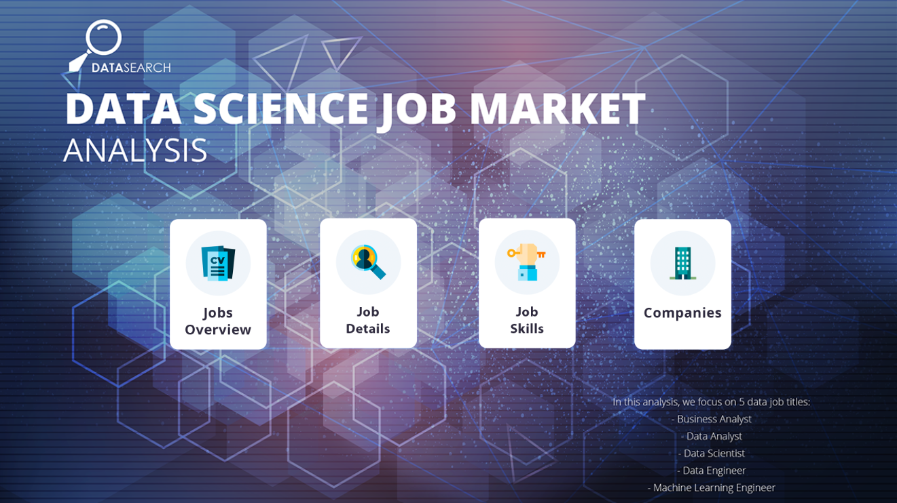
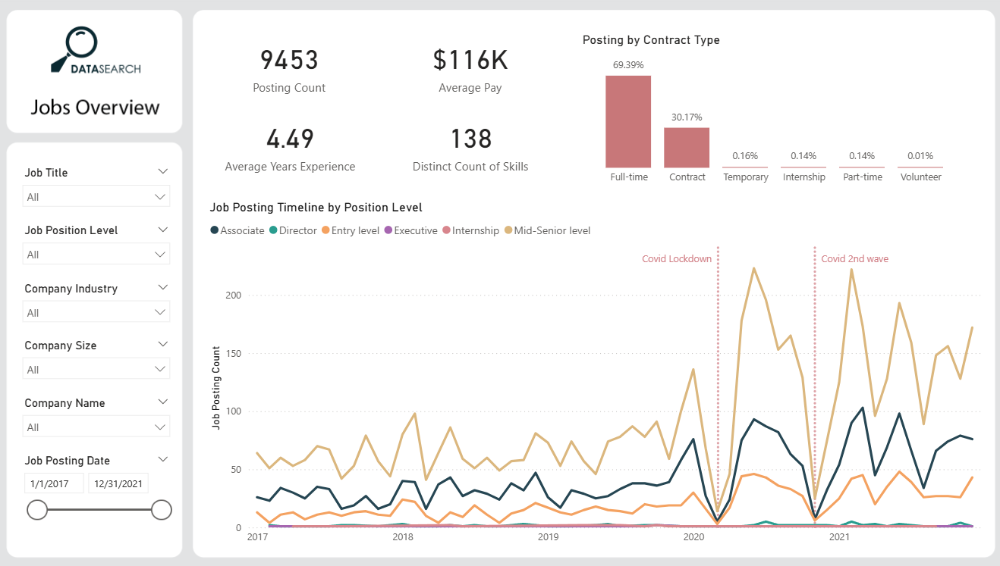
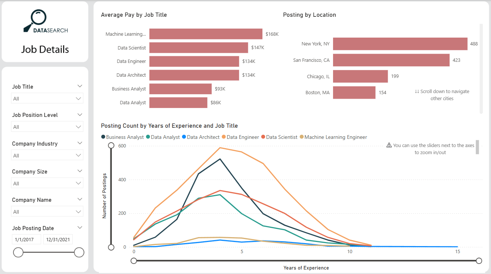
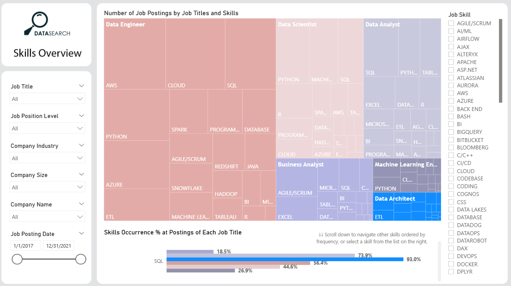
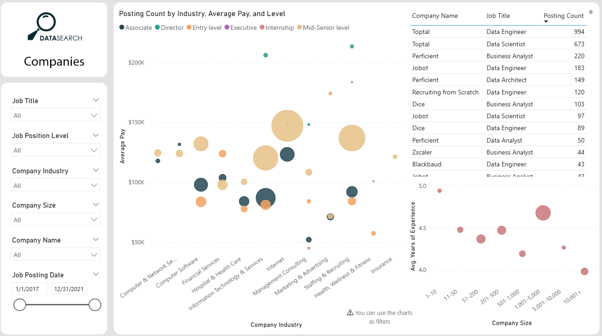

# 📊 Data Science Job Market Analysis — Power BI Dashboard

A multi-page interactive Power BI dashboard analyzing the **Data Science job market** from 2017 to 2021. The dashboard explores job postings, salary trends, required skills, and company insights across 5 major data job titles.

---

## 🗂️ Dashboard Pages

### 🏠 Cover Page

An introduction page outlining the 4 sections of the dashboard and the 5 job titles analyzed: Business Analyst, Data Analyst, Data Scientist, Data Engineer, and Machine Learning Engineer.

---

### 1️⃣ Jobs Overview

- **9,453** total job postings
- **$116K** average pay
- **4.49** average years of experience required
- **138** distinct skills identified
- Job posting timeline by position level with **Covid-19 impact annotations**
- Breakdown by contract type (Full-time 69%)

---

### 2️⃣ Job Details

- Average pay by job title — ML Engineers lead at **$168K**
- Top hiring locations — New York, San Francisco, Chicago, Boston
- Posting count by years of experience per job title

---

### 3️⃣ Skills Overview

- Treemap of skills by job title and frequency
- Skills occurrence % per job title (SQL appears in 93% of Data Analyst postings)
- Filterable by individual skill

---

### 4️⃣ Companies

- Bubble chart — average pay vs. company industry by seniority level
- Top companies by posting count (Toptal, Perficient, Jobot, Dice)
- Average experience vs. company size analysis

---

## 🔧 Tools & Technologies

| Tool | Usage |
|------|-------|
| **Power BI Desktop** | Dashboard design, data modeling, visualizations |
| **Power Query** | Data cleaning and transformation |
| **DAX** | KPI measures (avg pay, avg experience, distinct count) |

---

## ✨ Key Features

- 🎛️ Cross-page filters — Job Title, Position Level, Company Industry, Company Size, Date Range
- 📌 Covid-19 lockdown impact annotations
- 🌳 Treemap for skills distribution
- 🫧 Bubble chart for multi-dimensional company analysis

---

## 🚀 How to Open

1. Download [Power BI Desktop](https://powerbi.microsoft.com/desktop/) (free)
2. Clone or download this repository
3. Open `DataSearch-Dashboard.pbix`
